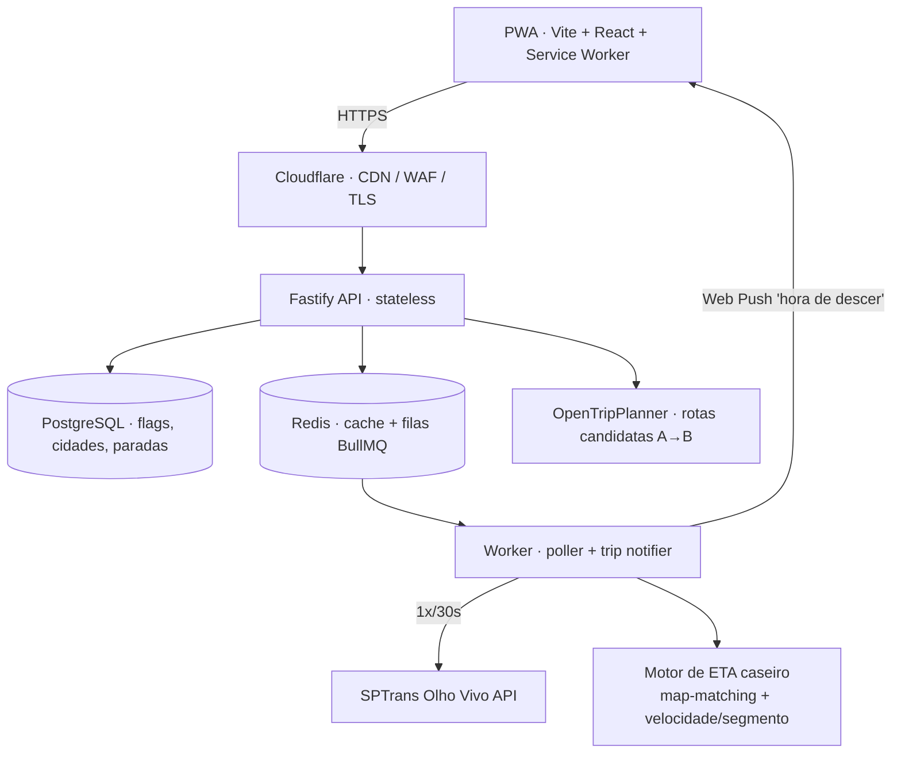

# 🚌 BUSZE

**Waze para ônibus em São Paulo.** Compara rotas de ônibus em tempo real e mostra
*onde* o trânsito vai te atrasar ao longo do trajeto — não só o ETA até o ponto.


> [!WARNING]
> **Fase atual: spike de validação.** O produto ainda **não** foi construído.
> Estamos provando que o motor de ETA realista é viável **antes** de escrever uma
> linha do app. Detalhes do ponto exato em [`spike/STATUS.md`](spike/STATUS.md).

---

## O problema

Quando várias linhas servem o mesmo par origem→destino, nenhum app hoje responde
com clareza à pergunta que importa na hora de decidir:

> **Qual ônibus chega primeiro no destino, considerando o trânsito atual no
> trajeto da linha** — e não só o ETA até o ponto?

Cittamobi, Moovit e Google Maps mostram posição e previsão de chegada *ao ponto*,
mas não comparam o tempo total *no destino* com o trânsito incorporado ao percurso.

## O diferencial — e por que ele é o risco

A SPTrans **não publica GTFS-Realtime**. A API Olho Vivo entrega só posição GPS
crua (`/Posicao`) e previsão ao ponto (`/Previsao`). Ou seja: a camada que colore
o trajeto por trânsito real, segmento a segmento (a essência da analogia com o
Waze), **precisa ser construída do zero** a partir das posições:

```
posições GPS  →  map-matching no shape do GTFS  →  velocidade real por segmento
              →  projeção de ETA  →  coloração verde/amarelo/vermelho
```

Esse motor é, ao mesmo tempo, o **único fosso real** do produto e o **maior risco
técnico**. Por isso ele vem antes de tudo — num spike isolado de de-risking.

## Onde estamos: o spike

Um coletor roda 24h num servidor, fazendo polling da Olho Vivo para um trio de
linhas escolhido a dedo, e grava cada leitura em SQLite. Depois de ~2 semanas,
uma análise offline mede o erro de projeção de ETA e decide **go/no-go**.

O trio foi escolhido a partir do GTFS estático (densidade no pico + cobertura de
corredor):

| Linha | Trajeto | Papel no spike |
|-------|---------|----------------|
| **875A** | Aeroporto – Perdizes | Corredor congestionado/variável (cruza Av. Paulista **e** 23 de Maio) |
| **106A** | Metrô Santana – Itaim Bibi | Compartilha o trecho da Paulista com a 875A → validação cruzada da velocidade por segmento |
| **2719** | Ermelino Matarazzo – Metrô Vl. Matilde | Controle estável, fora de corredor congestionado |

👉 Como rodar o coletor: [`spike/README.md`](spike/README.md).

## Arquitetura-alvo do produto



O worker centralizado chama a SPTrans 1x por intervalo para **todos** os usuários
(custo O(1), não O(usuários)) e alimenta o motor de ETA. O OTP só descobre rotas
candidatas por tabela; o ETA realista vem do motor caseiro.

## Roadmap

- [x] Brainstorm + design doc
- [x] Validação das fontes de dados (descoberto: SPTrans sem GTFS-RT)
- [x] Coletor de posições endurecido (spike)
- [x] Trio de linhas escolhido pelo GTFS
- [ ] Token Olho Vivo ativo *(aguardando propagação da SPTrans)*
- [ ] ~2 semanas de coleta
- [ ] Pipeline de análise (map-matching + velocidade/segmento + erro de ETA)
- [ ] **Decisão go/no-go**
- [ ] Se go: build do produto (PWA + API + workers)

## Stack

| Camada | Escolha |
|--------|---------|
| Spike (validação) | Python · requests · SQLite · pandas/shapely/gtfs_kit (análise) |
| Frontend (produto) | Vite + React + PWA |
| Backend (produto) | Fastify (Node + TypeScript) |
| Dados | PostgreSQL · Redis + BullMQ |
| Roteamento | OpenTripPlanner (GTFS estático) |
| Infra | Docker Compose · Cloudflare |

## Estrutura

```
busze/
├── docs/superpowers/specs/   # design doc do produto
└── spike/                     # coletor de validação do motor de ETA
    ├── collector.py           # poller Olho Vivo → SQLite
    ├── snapshot_gtfs.py       # congela o GTFS no T0 da coleta
    └── README.md / STATUS.md  # como rodar / onde paramos
```

## Licença

[MIT](LICENSE) © Breno Camargo
